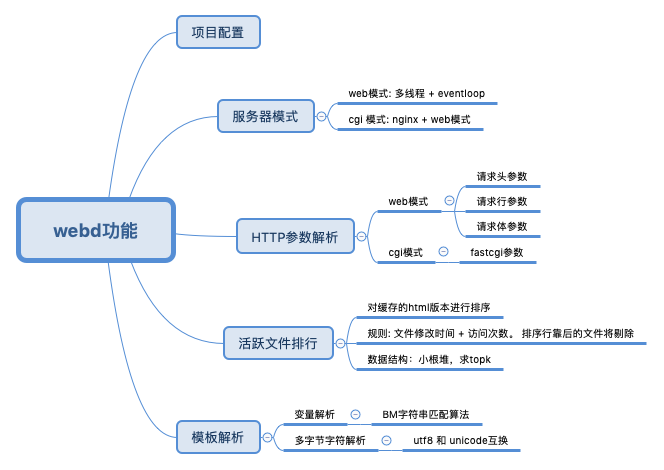

# WEB 服务器
## 功能介绍


## 环境
- OS: Centos7
- Complier: g++7

## 依赖库
- [NetWorker](https://github.com/Ivanqi/NetworkProgramBaseFrame)
```
networker 构建
./build.sh
./build.sh install
./migration.sh
```

## 目录结构
```
├── build   # 构建目录
├── cgi     # fastcgi配置文件目录
├── conf    # 项目配置文件目录
├── docs    # 文档目录
├── html    # 模板目录
├── logs    # 日志目录
└── src     # 主逻辑
```
## 项目配置参数
```
# ip 地址
ip=127.0.0.1
# 端口
port=8000
# html 根目录
web_root=../html/
# 线程数量
numTreads=0
# 日志等级
log_level=info
# 日志目录
log_dir=../logs/logger
# 服务模式 默认: web。 其他模式:cgi
server_mode=web
```

## 构建
```
cd build
make
```
## 使用
```
./webd 配置目录
```

## 技术点
- 使用Epoll边沿触发的IO多路复用技术，非阻塞IO，使用Reactor模式
- 使用多线程充分利用多核CPU，并使用线程池避免线程频繁创建销毁的开销
- 主线程只负责accept请求，并以Round Robin的方式分发给其它IO线程(兼计算线程)，锁的争用只会出现在主线程和某一特定线程中
- 使用eventfd实现了线程的异步唤醒
- 使用双缓冲区技术实现了简单的异步日志系统
- 为减少内存泄漏的可能，使用智能指针等RAII机制
- 使用状态机解析了HTTP请求

## 并发模型
